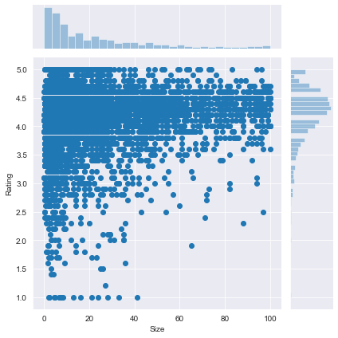
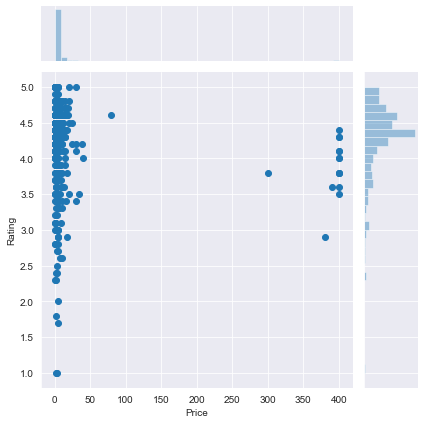
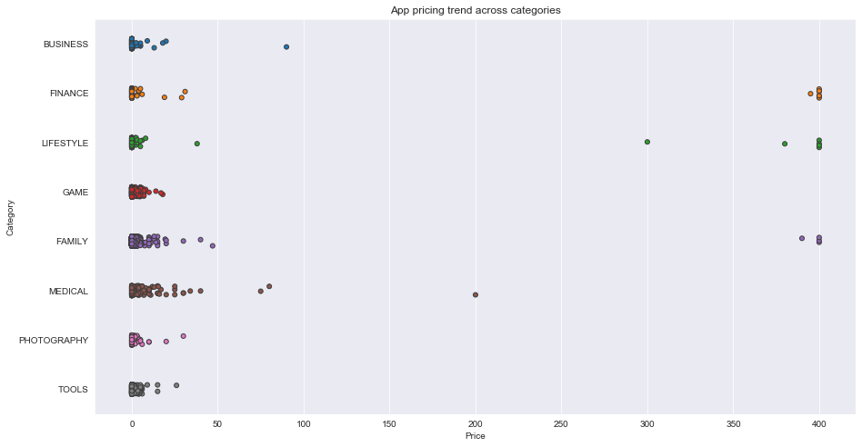
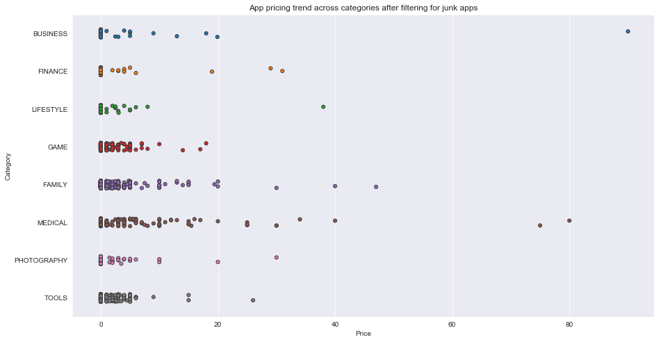
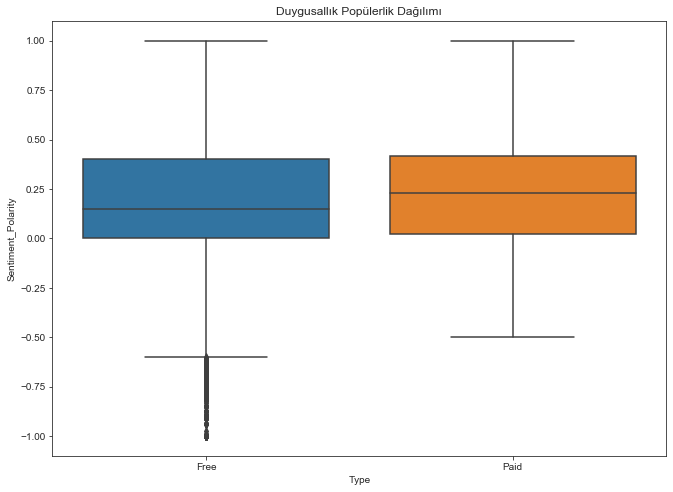

# GooglePlayStoreAnalysis

Mobil uygulamalar günümüz de hemen hemen her yerdedir. Onları oluşturmak kolay ve karlı dır. Bu iki etkenden dolayı günden güne daha fazla uygulama geliştirilmiş durumdadır. 
Bu proje de sizlere Google Play Store farklı kategorilerdeki binlerce uygulamayı kıyaslayarak Android App Market analizini yapmaktır.

## Veri Temizleme

Her zaman veri setindeki veriler istediğimiz şekilde gelmez. Bizler de veri setindeki Install kolonundaki , ve + karakterlerini ve 
Price kolonundaki $ karakterini kaldırmak isteriz. Dikkat edilemesi gerekirse kolonlar obje tipin de verilmiştir. 
Bizler daha kolay çalışma yapmak için float tipine çevirmemiz gerekir.

## Uygulama kategorilerini keşfetmek

Tüm araştırma deneyimlerini geliştirmek için, uygulamaları kategorilere gruplama kavramını tanıtmış durumda.

Aşağıdaki sorulara cevap arayalım:

* Marketteki uygulama payının en yüksek olduğu kategori hangisidir?

* Pazara hakim olana belli kategori var mı?

* Hangi kategoriler de en az sayıda uygulama vardır?

Biz veri setimizdeki 33 eşsiz kategoriyi inceleyeceğiz. Aile ve oyun uygulamaları en yaygın pazara sahiptir. Araç,iş ve tıp uygulamaları ayrıca zirvededir.

## Uygulama Oranlarının Dağılımı

Uygulama oranlarının ortalama dağılımı hesaplıyoruz. Dağılımı bir histogram grafiği ile 0 ile 1000 arasındaki etkisini inceliyoruz.

## Uygulamadaki fiyat ve boyutların kazançlar üzerindeki etkileri

Problemler kazanç gücü,internet hızı ve değişen oranlardan dolayı meydana gelebilir.

Peki bu problemlere ile başa çıkmak için nasıl verimli stratejiler uygulayabiliriz?

Uygulama boyutu oranınızı etkiler mi?
* Kullanıcılar gerçekten büyük mü yoksa küçük mü uygulamalar tercih ediyor?
* Fiyat uygulama oranınızı etkiler mi?
* Kullanıcılar genellikle bedava uyulamaları daha mı fazla tercih ediyor?

 

## Uygulama kategorisi ve uygulama fiyatları arasındaki ilişki

Farklı kategoriler, farklı fiyat aralıkları gerektirir. Hesap makinesi uygulaması gibi basit ve günlük olarak kullanılan bazı uygulamalar muhtemelen ücretsiz tutulmalıdır. Ancak, diyabetik hastaları teşhis eden oldukça uzmanlaşmış bir tıbbi uygulama için ücret almak mantıklı olacaktır. Aşağıda, 
Tıp ve Aile uygulamalarının en pahalı olduğunu görüyoruz. Bazı tıbbi uygulamalar 80 $ 'a kadar uzar! 
Tüm oyun uygulamaları makul olarak 20 doların altında fiyatlandırılır.

## Gereksiz Uygulamalar

Fiyatı 100 $ altındaki otantik uygulamalara sahip fiyata karşı kategorilerin fiyatlarını incelemek

## Paralı uygulamalara karşı bedava uygulamaların populerliği

Bugün Google Play Store da aşağıdaki gibi birkaç şekilde tür uygulamalar vardır.

Aşağıdaki ücretsiz uygulamaların özellikleri olarak sıralanabilir:
* Ücretsiz indirmek
* Genellikle reklamlardan gelen ana gelir kaynağı
* Şirketer tarafından oluşturulan ve uzantısı verilen uygulamalar

Aynı şekilde ücretli uygulamalrın özelliklerine değinelim:

* Kullanıcılardan, uygulamanın indirilmesi ve kullanılması için bir kez ödeme yapmaları istenir.
* Kullanıcı uygulamayı almadan önce uygulamayı deneyimleyemez.

